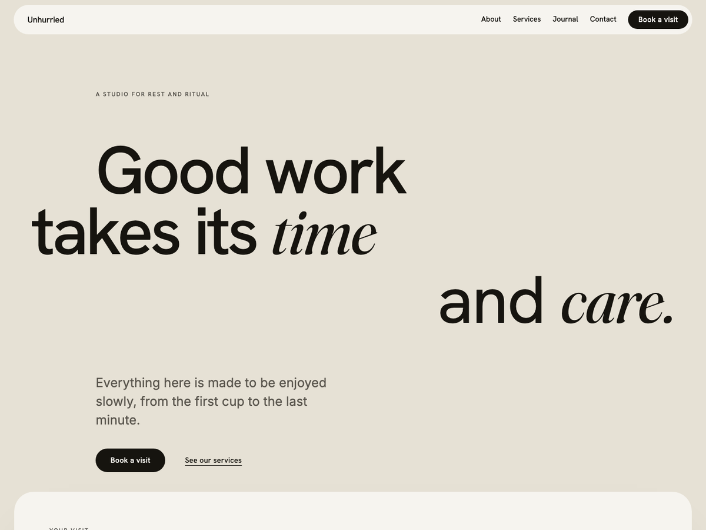

# Unhurried

A calm, editorial **WordPress block theme** for studios, spas, clinics and makers who sell care rather than speed. Made by [Switch Case Studio](https://switchcasestudio.com).

**Works with:** WordPress 6.6 or newer (tested on 7.1) · PHP 7.4+ · block themes only. It is not for Shopify, Webflow, Squarespace or other platforms.

## Install

**Download [`unhurried.zip`](https://github.com/Object-ions/unhurried/releases/latest/download/unhurried.zip)** from the latest release.

1. In WordPress, go to **Appearance → Themes → Add New → Upload Theme**.
2. Choose `unhurried.zip`, click **Install Now**, then **Activate**.

> Use the release zip, not GitHub's green **Code → Download ZIP** button. That one unpacks into a folder called `unhurried-main`, which breaks theme updates and Unhurried Pro.

Once the theme is approved on WordPress.org you can also search for **Unhurried** under Appearance → Themes → Add New.

## Set up your homepage (2 minutes)

1. **Pages → Add New**. In the page settings, pick the **Ground artboard** template.
2. When WordPress offers page patterns, choose **Homepage**. (Or add it later: **+ → Patterns → Pages → Homepage**.)
3. Publish, then set it under **Settings → Reading → Your homepage displays → A static page**.
4. Build **About**, **Services** and **Contact** the same way with their page patterns and the **Canvas** template.

There is a getting-started screen at **Appearance → About Unhurried**.

## What is included

- 27 patterns: homepage, about, services and contact pages; heroes; a visit/process panel; a services accordion; gallery; values statement; stories grid; testimonial; call to action; price list; membership tiers; FAQ; contact details; team feature.
- A blog: stories grid, category and tag archives, single posts with comments.
- Section styles for any Group (Panel, Card, Ink, Ground, Glass) and block styles (Eyebrow, Statement, Hairline and Text-link buttons, Arch and Keep-colour images).
- Style variations: default, **Nocturne** (dark) and **Linen** (warm).
- Tips: write an *italic* word in a heading for the Fraunces accent; add the class `unhurried-reveal` to any block for a gentle scroll reveal; `unhurried-mono` shows a block's images in greyscale.

## Want a shop?

[**Unhurried Pro**](https://switchcasestudio.com/unhurried-pro/) adds styled WooCommerce shop, product, cart and checkout pages, a Shop shelf pattern and a lead-story blog layout. It installs on top of this theme as a child theme.

## Development

WordPress Playground demo: `dev/serve.sh free` (or `pro`, which expects `../unhurried-pro`) serves on http://127.0.0.1:9400. `dev/validate.cjs` checks every pattern and template is block-valid; `dev/themecheck.cjs` runs the Theme Check plugin. `CHANGELOG.md` has the history.

## Licence and credits

© 2026 Moses Atia Poston, Switch Case Studio. GPL-2.0-or-later (see `LICENSE`). Fonts: Hanken Grotesk, Inter, Fraunces (SIL OFL 1.1). Images: original, CC0. Setup help: [switchcasestudio.com](https://switchcasestudio.com).
